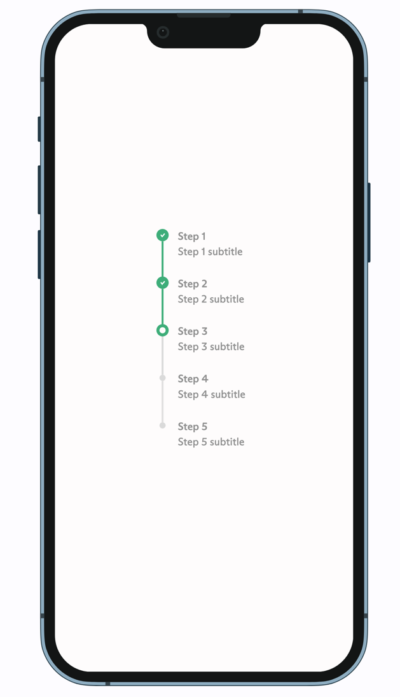

# nice_step_indicator

A package for nice step indicators in your app.


[Demo](assets/demo.gif)
## Features

- Customizable active and inactive colors
- Builder for child widgets
- Supports different step statuses (active, completed, inactive)

## Installation

Add `nice_step_indicator` to your `pubspec.yaml`:

```yaml
dependencies:
  nice_step_indicator: ^0.0.1
```

Then run `flutter pub get` to install the package.

## Usage

### Import the package

```dart
import 'package:nice_step_indicator/nice_step_indicator.dart';
```

### Example

Here is an example of how to use the `NiceStepIndicator` widget:

```dart
import "package:flutter/material";
import "package:nice_step_indicator/nice_step_indicator.dart";

/// A model representing a step in the progress indicator.
class ProgressStep {
  /// Creates a [ProgressStep] with the given [title], [subtitle], and [status].
  const ProgressStep({
    required this.title,
    required this.subtitle,
    this.status = StepLineStatus.inactive,
  });

  /// The title of the step.
  final String title;

  /// The subtitle of the step.
  final String subtitle;

  /// The status of the step, which can be active, completed, or inactive.
  final StepLineStatus status;
}

/// The main application widget.

class App extends StatelessWidget {
  const App({super.key});

  @override
  Widget build(BuildContext context) {
    // Generate a list of steps for the progress indicator.
    final steps = List.generate(
      5,
          (index) =>
          ProgressStep(
            subtitle: 'Step ${index + 1} subtitle',
            title: 'Step ${index + 1}',
          ),
    );

    return MaterialApp(
      theme: ThemeData(
        appBarTheme: AppBarTheme(
          backgroundColor: Theme
              .of(context)
              .colorScheme
              .inversePrimary,
        ),
        useMaterial3: true,
      ),
      localizationsDelegates: AppLocalizations.localizationsDelegates,
      supportedLocales: AppLocalizations.supportedLocales,
      home: Center(
        child: NiceStepIndicator<ProgressStep>(
          items: steps,
          builder: (context, _, item) =>
              Column(
                crossAxisAlignment: CrossAxisAlignment.start,
                children: [
                  Text(item.title),
                  const SizedBox(height: 8),
                  Text(item.subtitle),
                ],
              ),
          status: (item) => StepLineStatus.fromString(item.status.name),
        ),
      ),
    );
  }
}
```

### Customization

You can customize the `NiceStepIndicator` widget by providing different values for the following
properties:

- `activeColor`: The color of the active step.
- `inactiveColor`: The color of the inactive step.
- `dotOffset`: Optional offset for the dot indicator item.
- `offset`: Optional offset for the step indicator item, providing padding around the step.
- `strokeWidth`: The width of the stroke.

### API Reference

#### NiceStepIndicator

A widget that displays a series of step indicators.

##### Properties

- `activeColor`: The color of the active step.
- `builder`: The child widget builder.
- `dotOffset`: Optional offset for the dot indicator item.
- `inactiveColor`: The color of the inactive step.
- `items`: The data to render in the steps.
- `offset`: Optional offset for the step indicator item, providing padding around the step.
- `status`: The indicator status builder.
- `strokeWidth`: The width of the stroke.

#### StepWidgetBuilder

A function that builds a widget for a step indicator item.

##### Parameters

- `BuildContext context`: The build context.
- `int index`: The index of the item.
- `T item`: The item itself.

#### StepStatusBuilder

A function that determines the status of a step indicator item.

##### Parameters

- `T item`: The item itself.

##### Returns

- `StepLineStatus`: The status of the step indicator item.

## License

This project is licensed under the MIT License.

### Bugs or Requests

If you encounter any problems feel free to open
an [issue](https://github.com/ethiel97/nice_step_indicator/issues/new?template=bug_report.md).
If you feel this package is missing a
feature, please raise a ticket
on [GitHub](https://github.com/ethiel97/nice_step_indicator/issues/new?template=feature_request.md)
and I'll look into it. Pull request are also welcome.